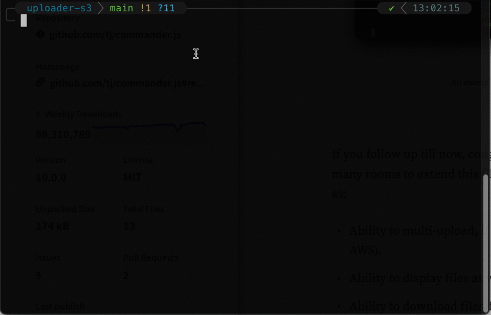

# upload-tool-s3



## Overview

`upload-tool-s3` is a CLI application to help uploading file or folder to AWS S3. This document provides instructions on how to use the project, its features, and its limitations.  

Articles on Medium about how to build this project is posted in here [PART 1](https://medium.com/@techwithharry/files-uploader-cli-with-nodejs-typescript-and-aws-s3-part-1-2-86fc29e919ad) and [PART 2](https://medium.com/@techwithharry/files-uploader-cli-with-nodejs-typescript-and-aws-s3-part-2-2-bf0518c51888).

## Installation

Clone the project and then install all the dependencies using `npm`.

```bash
cd upload-tool-s3
npm install
```

## Usage

First, create a new file `.env` in the root directory that contains all the information about IAM user (can reference to `.env.sample` file), or you can run the script with `env` flag on the fly.

If you already created `.env` file

```bash
npm start <path-to-file-or-folder>
```

If you choose not create `.env` file

```bash
env AWS_ACCESS_KEY=<your-access-key> AWS_SECRET_KEY=<your-secret-key> AWS_REGION=<your-region> npm start <path-to-file-or-folder>

# Example
env AWS_ACCESS_KEY=abc123 AWS_SECRET_KEY=abc123 AWS_REGION=us-east-1 npm start <path-to-file-or-folder>
```

## Features

- Ability to list all the buckets
- Ability to select/view the existing folders
- Ability to create new folder and upload
- Ability to create new bucket and upload
- Ability to keep the parent folder

## Limitations

- Not utilize the multipart uploading technique for large size, so it can be slow if upload a large chunk of files.
- No back navigation given in the menu list.
- Only display folders and sub-folders, there are no display for files.

## Contributing

View [CONTRIBUTING](./CONTRIBUTING.md).

## License

View [LICENSE](./LICENSE.txt).

## Acknowledgments

Will be updated as time goes by.

## Contact

[Email](mailto:ngohuynhnhan@gmail.com).

## Resources

Official AWS S3 SDK: https://docs.aws.amazon.com/AWSJavaScriptSDK/v3/latest/clients/client-s3/classes/s3.html  
Official AWS S3: https://docs.aws.amazon.com/AmazonS3/latest/userguide/GetStartedWithS3.html  
NPM Inquirer: https://www.npmjs.com/package/inquirer  
NPM Commander: https://www.npmjs.com/package/commander
